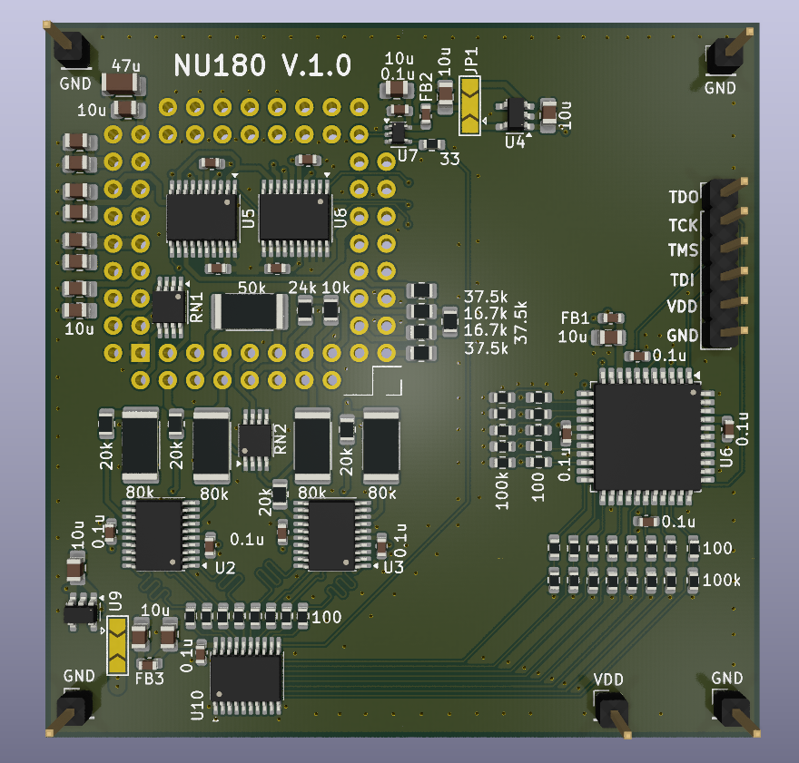

# NU180
“NU180” is a project to create a drop-in replacement for the "U180" hybrid in the HPAK 3458A 8.5 digit DVM.

The 3458A’s “A3” ADC board contains a custom hybrid, "U180," that is often found to have problems with excessive drift, causing unreliable measurements or even complete failure. These hybrids are absolutely unobtainable, leading to the unfortunate retirement of many machines. It's a plague! Something must be done! :)

HP designed U180 in the 1980’s. In one package, it includes a custom current-steering chip and a custom resistor array. People on this forum and elsewhere have analyzed U180 to the point that a reverse-engineered replacement became conceivable. The circuitry needed includes a small amount of control logic, analog switches for current-steering, and a set of high-precision resistors. Would a “NU180” have the same performance as U180? It's getting very close indeed!

## EEVBlog thread

Follow the [thread here](https://www.eevblog.com/forum/metrology/nu180-a-u180-drop-in-project-for-the-3468a-dvm/) for any updates and discussion surronding the project! 

## Schematic

[View the schematic pdf](./NU180_V.1.0/NU180.pdf)

## Render

